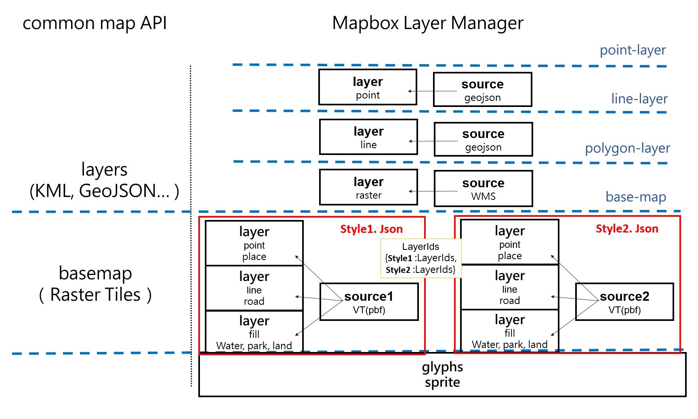

# MapboxLayerManager

## Introduction

MapboxLayerManager is a layer management tool designed specifically for Mapbox GL JS. It solves the problem of losing custom layers when switching styles using the native `setStyle` method in Mapbox GL JS, while providing a flexible API for managing map layers. The design philosophy of this tool is similar to common map API architectures, allowing developers to more intuitively operate and manage map layers.

## Key Features

1. **Architecture Similar to Common Map APIs**:
   Mapbox GL JS originally doesn't distinguish between base maps and other layers, with all layers belonging to a single style. This package uses layer visibility control to make Mapbox GL JS usage more similar to common map API architectures.

2. **Solves the setStyle Problem**:
   Preserves custom layers when switching base map styles, avoiding layer and resource loss caused by using the native `setStyle` method. Other operations remain consistent with native Mapbox GL JS.

3. **Supports WMTS Layers**:
   Can directly use WMTS layers, providing greater flexibility.

4. **Supports Multiple Style Loading**:
   Allows loading and managing layers from multiple style.json configuration files in a single map instance. Supports defining styles using either a single URL string or an array of URL strings, enabling more complex style combinations.

5. **Indicator Layer Mechanism**:
   Introduces special indicator layers (base-map, polygon-layer, line-layer, point-layer), allowing newly added layers to be automatically inserted into the correct position based on their type, simplifying layer management.

## Working Principle

1. **Style Switching**:
   When switching base map styles, MapboxLayerManager only toggles the visibility of corresponding layers, rather than reloading the entire style, thus preserving custom layers.

2. **Layer Insertion Order**:
   By intercepting the `map.addLayer` method, it ensures that newly added layers are inserted into predefined correct positions. By default, layers are automatically inserted below the corresponding indicator layer based on their type (point, line, polygon). If you need to add a layer to the top, you can use the special parameter `'null'`.

## Layer Architecture



Layer Architecture Explanation:

- The bottom layer consists of base map layers. All base map style layers coexist simultaneously, but are displayed or hidden by controlling the visibility property.
- The middle layer contains indicator layers, divided into polygon, line, and point types.
- Custom layers are automatically inserted below the corresponding indicator layer based on their type.
- The top layer consists of layers added using the 'null' parameter, which are positioned above all other layers.

## Notes

- When using this package, avoid using the `map.import()` and `map.setConfigProperty()` methods.
- Loading style.json resources starting with `mapbox://` is not supported. You need to find the original URL. Please refer to .env.example.
- Mapbox can only load sprites and glyphs once. For glyphs (font files), specifying one is sufficient; although the font may differ slightly from the original, it's acceptable as long as it displays correctly. Handling sprites is more complex: if there are multiple sprite files, they need to be merged and loaded as a single file. If all sprite files are in SVG format, you can use the official Mapbox tool [spritezero](https://github.com/mapbox/spritezero) to merge them.
- When adding a layer to a specific base map, the actual layer ID becomes `${basemap_name}-${original_layer_id}`. For example, if you add a layer with ID 'customLayer' to the 'satellite' base map, the actual layer ID will be 'satellite-customLayer'. When performing layer operations (such as show, hide, delete, etc.), be sure to use this complete ID.

## Demo

We provide a sample project that demonstrates the main features and usage of MapboxLayerManager.

### Location

The sample code is located in the `demo/src/App.vue` file.

### Implemented Features

This demo showcases the following features:

1. **Initializing MapboxLayerManager**:

   - Setting up multiple styles (1. Streets 2. Satellite with streets 3. WMTS Japan)

2. **Creating a Map**:

   - Creating a map using the default style

3. **Switching Base Maps**:

   - Using `map.changeBaseMap` to switch base maps

4. **Adding Custom Layers**:

   - Layer position is not dependent on the order of addition but is inserted below the corresponding indicator layer based on type
   - Using the 'null' parameter to add layers to the top

5. **Inserting Layers into Specific Base Maps**:
   - Additionally adding contour layers to the satellite with streets base map

## Installation

```bash
npm install mapbox-layer-manager
```

## Basic Usage

### Initialization

```javascript
import MapboxLayerManager from "mapbox-layer-manager";
import mapboxgl from "mapbox-gl";
const mapboxLayerManager = new MapboxLayerManager({
  mapboxgl: mapboxgl,
  styles: {
    streets: "URL_TO_STREETS_STYLE",
    satellite: ["URL_TO_SATELLITE_STYLE", "URL_TO_ADDITIONAL_STYLE"],
  },
  mapboxAccessToken: "YOUR_MAPBOX_ACCESS_TOKEN",
  sprite: "mapbox://sprites/mapbox/streets-v12",
  glyphs: "mapbox://fonts/mapbox/{fontstack}/{range}.pbf",
});
```

Note: The style URL can be a single string or an array of strings. When using an array, you can specify multiple style files, which will be merged.

### Creating a Map

```javascript
const map = await mapboxLayerManager.createMap({
  container: "map",
  options: {
    center: [121.5, 25.05],
    zoom: 15,
  },
  defaultStyle: "streets",
});
```

### Switching Base Maps

```javascript
map.changeBaseMap("satellite");
```

### Adding Layers

#### Adding a Regular Layer

```javascript
map.addLayer({
   id: 'layerId',
   type: 'line',
   source: {
      type: 'geojson',
      data: { / GeoJSON data / }
   },
   paint: {
   // 圖層樣式
   }
});
```

Note: When adding a layer, it will be automatically inserted below the corresponding point, line, or polygon indicator layer based on its type. If you want to add the layer to the top, you can use `'null'` as the second parameter of the `addLayer` method.

#### Adding a Single Layer to a Specific Base Map

```javascript
map.addSingleLayerToBasemap("satellite", {
  id: "layerId",
  type: "line",
  source: {
    type: "vector",
    url: "mapbox://mapbox.mapbox-terrain-v2",
  },
  "source-layer": "contour",
  paint: {
    // 圖層樣式
  },
});
```

## License

This project is licensed under the MIT License - see the [LICENSE](LICENSE) file for details.

This project depends on Mapbox Web SDK. Use of Mapbox Web SDK is subject to the [Mapbox Terms of Service](https://www.mapbox.com/legal/tos/). Users of this software must ensure they comply with Mapbox's terms when using functionality that relies on Mapbox Web SDK.
